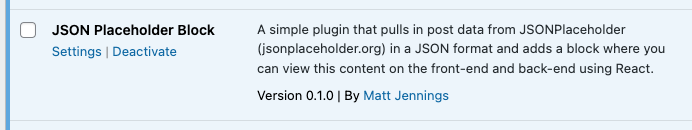
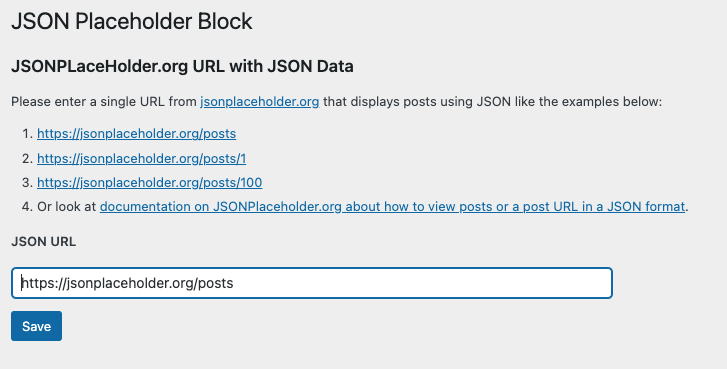
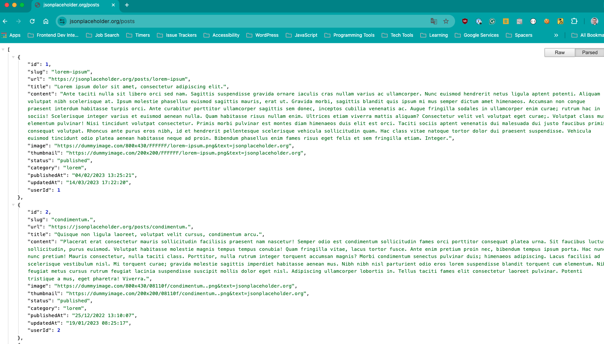
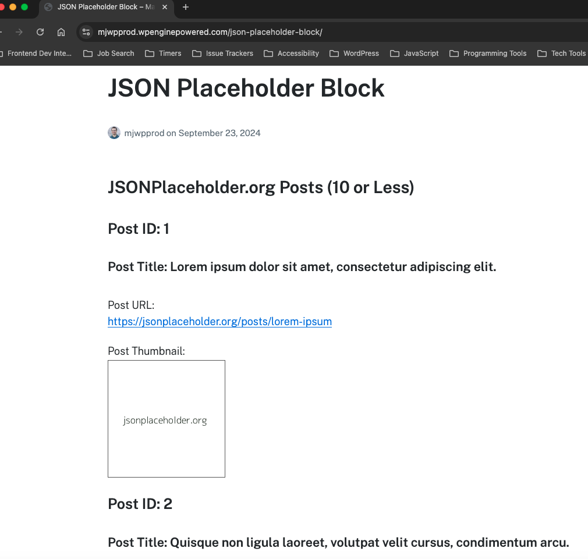
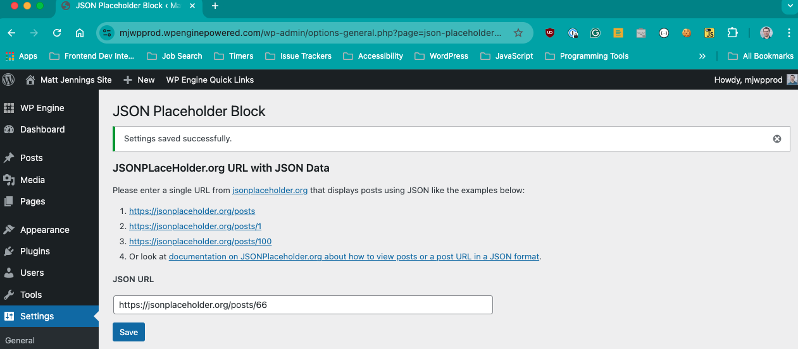
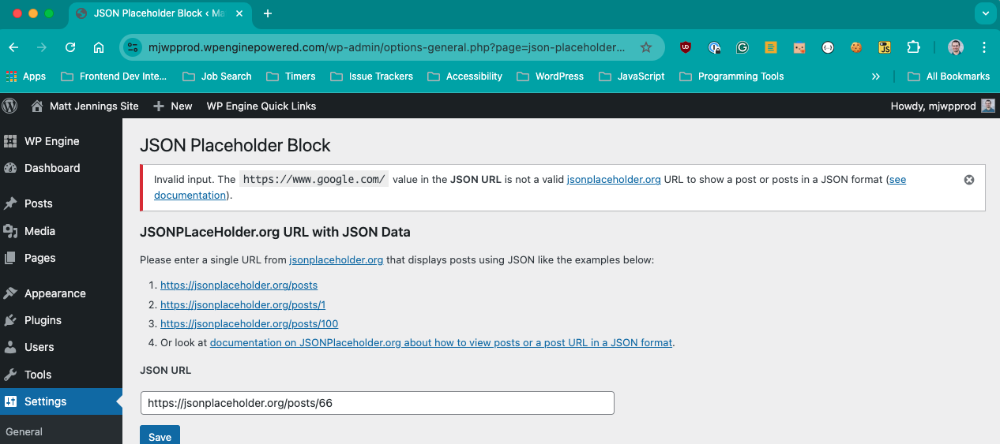
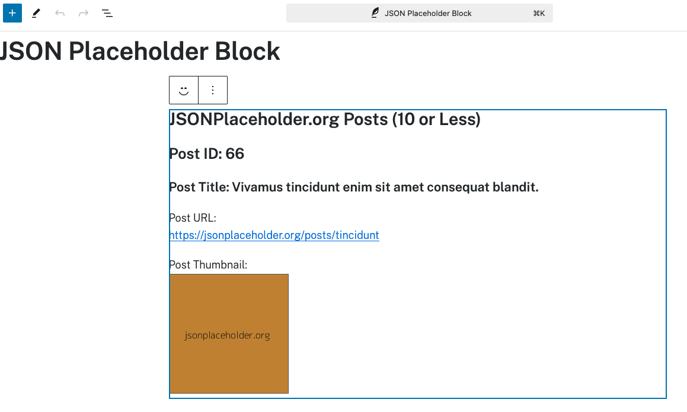
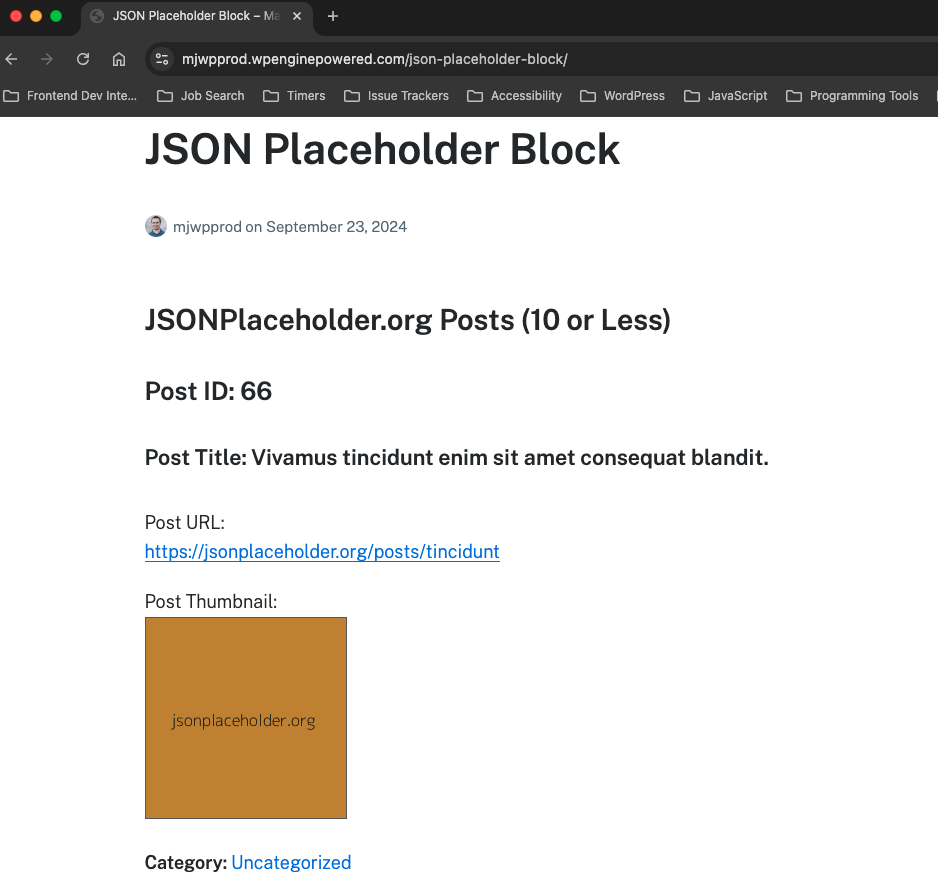

# JSON Placeholder Block

## Description
A simple WordPress (WP) plugin that pulls in post data from JSONPlaceholder (jsonplaceholder.org) in a JSON format and adds a block where you can view this content on the front-end and back-end using React.

## Why?
This plugin was created so I (Matt Jennings - [see portfolio](https://www.mattjennings.net/)) could a WP plugin that:
- Has a settings page where I could add in a URL to show posts on jsonplaceholder.org (like [https://jsonplaceholder.org/posts](https://jsonplaceholder.org/posts) or [https://jsonplaceholder.org/posts/66](https://jsonplaceholder.org/posts/66)) in a JSON format which is saved to the WP database

- Create a [block](https://developer.wordpress.org/block-editor/) that pulls in the JSON data using the [WordPress](https://learn.wordpress.org/tutorial/using-the-wordpress-rest-api/) using React in the WP Admin for a post or page AND the front-end

## Details and Screenshots
1. __JSON Placeholder Block__ block listed on the __Plugins__ page in the WP Admin with a __Settings__ link to it's custom settings page:  
   
2. __JSON Placeholder Block__ custom settings page in WP Admin:
   
3. Screenshot of JSON from [https://jsonplaceholder.org/posts](https://jsonplaceholder.org/posts):
   
4. __JSON Placeholder Block__ block in WP Admin on a post:
   
5. __JSON Placeholder Block__ block on the front-end of a post:
   
6. __JSON Placeholder Block__ settings page successful update (changing `https://jsonplaceholder.org/posts` to `https://jsonplaceholder.org/posts/66` in field):
   
7. __JSON Placeholder Block__ settings page failed update and error message (failing to change `https://jsonplaceholder.org/posts/66` to `https://www.google.com/` in field):
   
8. __JSON Placeholder Block__ block successful update on post in WP Admin (after changing `https://jsonplaceholder.org/posts` to `https://jsonplaceholder.org/posts/66` in plugin settings):
   
9. __JSON Placeholder Block__ block successful update post WP front-end (after changing `https://jsonplaceholder.org/posts` to `https://jsonplaceholder.org/posts/66` in plugin settings):
      

## Developer Setup
1. Assuming you have Node.js and npm installed, download or fork this repo and in the root do:  
   `npm i`
2. For local development, to build continuously do:
   `npm start`
3. To build for production do:
   `npm run build`
4. Other important npm scripts in __package.json__:
   - Lint JavaScript (JS): `npm run lint`  
   - Format JS: `npm run format`    

## Demo of "JSON Placeholder Block" block on Front-End
[https://mjwpprod.wpenginepowered.com/json-placeholder-block/](https://mjwpprod.wpenginepowered.com/json-placeholder-block/)   